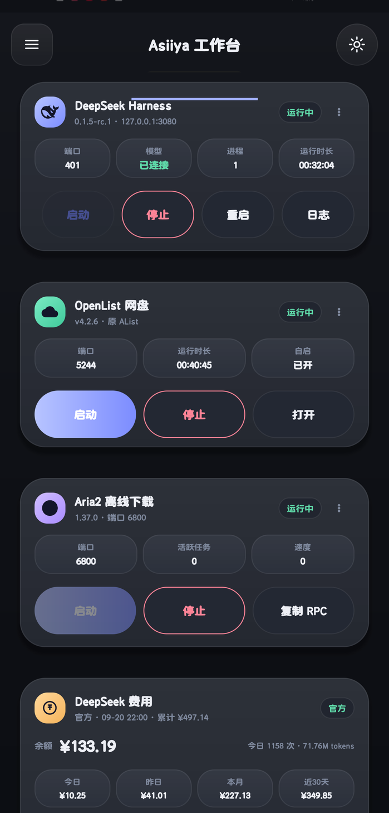
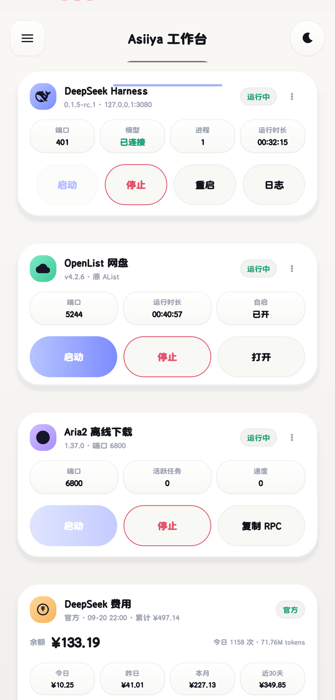

<div align="center">

# Asiiya

**Android 上的 DeepSeek Harness 控制台 —— 一键部署 + 原生管理 App**

在手机 Termux 里原生运行 [DeepSeek Harness](https://github.com/deepseek-ai/deepseek-harness)，
并用一个**原生 Android App** 管理它：启动/停止、端口与模型、余额与用量、离线下载、网盘 —— 全在一块屏幕上。

`Kotlin` · `ViewBinding` · `minSdk 26` · 深色 / 浅色双模

[](https://github.com/jackasan1/asiiya-console/releases/latest)
[](https://github.com/jackasan1/asiiya-console/actions/workflows/android.yml)

&nbsp;&nbsp;

<sub>真机截图 · 深色 / 浅色双模</sub>

</div>

---

> 🇨🇳 中文说明在下方 · Click a language below to view its README.

> [!IMPORTANT]
> **当前最高支持 deepseek-harness rc.7**，向下兼容 rc.6 及更早版本。

---

<details open>
<summary><b>🇨🇳 中文</b> · 点击收起/展开中文说明</summary>

## 这是什么

在 Android 手机上原生运行 DeepSeek Harness（`@deepseek-ai/dsh`，DeepSeek 官方的 agent harness，类 Claude Code）。通过 **Web UI**（`http://127.0.0.1:3080`）在手机浏览器里使用，agent 可在手机上真实执行 bash 命令。

> ⚠️ **需要 Termux**：必须在 Android 手机的 Termux 终端里安装运行。**不要用 Google Play 版 Termux**（已过时）。

### 管理 App（Asiiya 工作台）

不想每次敲命令？可以装一个原生 App 来管它：

| 能力 | 说明 |
|---|---|
| 🎛 **服务控制** | Harness / OpenList / Aria2 三张卡，启动 · 停止 · 重启 · 看日志 |
| 📊 **状态一屏** | 端口、模型连接状态、进程数、运行时长 |
| 💰 **费用与用量** | 余额、今日/昨日/本月/近 30 天、预算进度、花费走势 |
| 📥 **离线下载** | 分享链接到 App 直接丢给 Aria2，支持剪贴板批量 |
| 🧭 **抽屉导航** | 一级项目目录 → 二级操作台 |
| 🌗 **深浅双模** | 跟随系统，也可手动切换 |
| 🖼 **桌面小组件** | 状态常驻桌面，一键启停 |

**下载**：[最新 Release](https://github.com/jackasan1/asiiya-console/releases/latest) → `app-release.apk`

> App 通过 Termux 的 `RUN_COMMAND` 接口工作，**不需要 root**。
> 首次使用需在 Termux 里执行一次：
> ```bash
> mkdir -p ~/.termux && echo 'allow-external-apps=true' >> ~/.termux/termux.properties
> ```
> 然后重启 Termux，并在首次打开 App 时授予「运行 Termux 命令」权限。


### 一、安装 Termux

- **F-Droid（推荐）**：<https://f-droid.org/en/packages/com.termux/>
- **GitHub Releases**：<https://github.com/termux/termux-app/releases>

打开 Termux 后执行 `pkg update -y`。

### 二、一键安装

```bash
pkg install -y git
git clone https://github.com/jackasan1/asiiya-console.git
cd asiiya-console
bash setup.sh
```

> 🇨🇳 **国内用户提示**：`setup.sh` 会自动测速，npm / nodejs.org 较慢时**自动切换到 npmmirror 镜像**（仅本次会话生效，不改全局配置）。若 `git clone` 很慢或超时，请先开代理/TUN，或改用镜像 clone（如 `https://gitclone.com/github.com/jackasan1/asiiya-console.git`）。

### 三、使用

```bash
bash ~/dsh/start_dsh.sh   # 启动并自动拉起浏览器
bash ~/dsh/stop_dsh.sh    # 停止
```

打开 <http://127.0.0.1:3080>，在 **Models** 页填入你的 **DeepSeek API Key**（存于 `~/.dsh/.credentials.yaml`，0600 权限），即可开始。

### 四、setup.sh 自动修复的 Android 兼容问题

| 问题 | 现象 | 修复 |
|---|---|---|
| node-pty 无法编译 | `Undefined variable android_ndk_path` | 修补 node-gyp 缓存 `common.gypi` |
| koffi 无法编译 | `statx` 相关 `__u32` 编译错误 | `-target aarch64-linux-android30` |
| npm 拦截构建脚本 | node-pty/koffi 无产物 | `--allow-scripts` 放行 |
| `link()` 被禁（SELinux） | 会话/附件保存、write 工具新建文件报 `EACCES` | 会话/附件发布改 `rename()`；write 新建文件回退"O_EXCL 占位+rename"；附件祖先遍历/清理容忍（`patches/patch-dsh-android-link.js`，幂等） |
| PTY 终端检测失败 | `unsupported on platform android` | subprocess 把 android 视同 linux |
| sharp 无法加载 | `Could not load sharp module` | 安装 `@img/sharp-wasm32` wasm 回退 |
| HMR 启动崩溃 | `--expose-internals is required` | 包装脚本加 `--expose-internals` |
| bash 工具不可用 | `SANDBOX_UNAVAILABLE` | 权限模式设 `danger-full-access` |
| 前端不适配竖屏 | 桌面布局、触控目标小等 | `apply-frontend.sh` 注入移动端 CSS/JS |
| 软键盘遮挡输入框 | 输入法弹出后输入框被键盘盖住 | `visualViewport` 跟随：键盘弹出时整页（含输入框）抬到键盘上方，收回时还原 |
| 局域网 HTTP 缺少 Web Crypto API | `crypto.randomUUID is not a function` | 注入基于 `crypto.getRandomValues()` 的 UUID v4 回退 |
| 上下文大时重进/切回卡顿 | 冷重进、从外部应用切回要等很久 | `apply-js-patches.sh`：history 窗口瘦身（chunk 流过滤+大结果截断）+ 重连增量同步（保留窗口静默补齐） |
| 整页重载重复下载 JS | 每次刷新重下 ~4.7MB bundle | 静态资源与插件 bundle 加 immutable 缓存头 |
| PWA 沉浸模式键盘不跟随 | fullscreen 下软键盘覆盖、视口不收缩，composer 被盖住 | manifest display 改 `standalone`（需重装 PWA，恢复系统栏+正常键盘行为）|

### 五、安全说明

- 服务只监听 `127.0.0.1`（本机），不走局域网。
- API Key 存 `~/.dsh/.credentials.yaml`（0600），不进日志、不进进程环境。
- `danger-full-access` 关闭了进程沙箱（Android 无 bwrap/landlock 替代），agent 可执行任意命令——仅建议个人设备使用。
- 升级 dsh 或 Node 后需重跑 `setup.sh`。

### 六、常见问题

- **页面白屏/打不开**：确认在 Termux 环境；看日志 `~/dsh/storage/dsh.log`。
- **`AbortSignal.any is not a function`**：浏览器过旧，`apply-frontend.sh` 已注入 polyfill。
- **`crypto.randomUUID is not a function`**：局域网 HTTP 或旧版 WebView 不暴露该 API，`apply-frontend.sh` 已注入安全随机 UUID v4 回退。
- **模型没反应**：检查 Models 页 API Key 与 `~/.dsh/.credentials.yaml`。
- **换机/重装**：重跑 `bash setup.sh`。

### 七、作者测试环境与兼容性

- **测试设备**：华为 Mate 60（ALN-AL80），HarmonyOS 4.2.0（build 4.2.0.186），**无 root**，Termux（Node v26，aarch64）。
- 不同手机 / ROM 的差异可能导致额外问题，例如：部分 ROM 通过 SELinux 禁用 `link()` 系统调用（会话/附件无法持久化，本脚本已改为 `rename()` 修复）、命名空间沙箱权限不同、bwrap/landlock 是否可用等。
- `setup.sh` 覆盖了通用 Android 场景，但个别机型可能需要额外适配。

**欢迎提 issue / PR 适配更多环境**：如果你在其它品牌、系统版本或 root 状态下遇到问题，欢迎在 [Issues](https://github.com/jackasan1/asiiya-console/issues) 提交，或提交 Pull Request 补充对应机型的修复。

### 设计

界面经历过一次完整重构（「柔光层叠」方向），相关文档：

- [设计方向提案](docs/design/ui-directions.html) — 3 套风格方向的完整对比
- [实现版预览](docs/design/implementation-preview.html) — 真实 Token 值渲染
- [Token 施工图](docs/design/design-tokens.md) — 色值 / 尺寸 / 字阶 / 动效规格
- [更新日志](CHANGELOG.md)

### 参考

- [deepseek-ai/deepseek-harness](https://github.com/deepseek-ai/deepseek-harness)
- [deepseek-harness Discussion #136 — Android/Termux 部署](https://github.com/deepseek-ai/deepseek-harness/discussions/136)
- [deepseek-harness Discussion #248 — Android 禁 hardlink（link→rename 提案）](https://github.com/deepseek-ai/deepseek-harness/discussions/248)
- [Termux Wiki](https://wiki.termux.com/)

</details>

---

<details>
<summary><b>🇬🇧 English</b> · click to expand/collapse</summary>

## What is this

Run [DeepSeek Harness](https://github.com/deepseek-ai/deepseek-harness) (`@deepseek-ai/dsh`, DeepSeek's official agent harness, Claude Code–like) natively on Android. Use it through the **Web UI** at `http://127.0.0.1:3080` in your mobile browser; the agent can run real bash commands on the phone.

> ⚠️ **Termux required**: install and run inside the **Termux terminal on your Android phone**. Do **NOT** use the Google Play version (outdated).

### 1. Install Termux

- **F-Droid (recommended)**: <https://f-droid.org/en/packages/com.termux/>
- **GitHub Releases**: <https://github.com/termux/termux-app/releases>

Run `pkg update -y` after opening Termux.

### 2. One-click setup

```bash
pkg install -y git
git clone https://github.com/jackasan1/asiiya-console.git
cd asiiya-console
bash setup.sh
```

> `setup.sh` auto-detects slow npm / nodejs.org and switches to the npmmirror mirror when needed (session-only, doesn't change your global config).

### 3. Usage

```bash
bash ~/dsh/start_dsh.sh   # start & auto-open browser
bash ~/dsh/stop_dsh.sh    # stop
```

Open <http://127.0.0.1:3080>, enter your **DeepSeek API Key** in the **Models** page (stored at `~/.dsh/.credentials.yaml`, mode 0600), and start chatting.

### 4. Android issues auto-fixed by setup.sh

| Issue | Symptom | Fix |
|---|---|---|
| node-pty fails to build | `Undefined variable android_ndk_path` | patch node-gyp cache `common.gypi` |
| koffi fails to build | `statx` `__u32` compile error | `-target aarch64-linux-android30` |
| npm blocks build scripts | no node-pty/koffi output | allow via `--allow-scripts` |
| `link()` blocked (SELinux) | `EACCES` saving sessions/attachments, and when `write` tool creates a new file | session/attachment publish uses `rename()`; new-file write falls back to "O_EXCL reserve + rename"; attachment ancestor-walk & cleanup tolerate EACCES/ENOENT (`patches/patch-dsh-android-link.js`, idempotent) |
| PTY terminal detection fails | `unsupported on platform android` | treat android as linux in subprocess |
| sharp fails to load | `Could not load sharp module` | install `@img/sharp-wasm32` wasm fallback |
| HMR crashes on start | `--expose-internals is required` | wrapper script adds `--expose-internals` |
| bash tool unavailable | `SANDBOX_UNAVAILABLE` | permission mode `danger-full-access` |
| Frontend not mobile-ready | desktop layout, small touch targets | `apply-frontend.sh` injects mobile CSS/JS |
| Soft keyboard covers the input | input box hidden behind the IME when it opens | `visualViewport`-driven follow: page (incl. input) lifts above the keyboard on open, restores on close |
| Web Crypto API missing over LAN HTTP | `crypto.randomUUID is not a function` | inject a UUID v4 fallback based on `crypto.getRandomValues()` |
| Lag re-entering / switching back with big context | cold re-entry and app-return stall for seconds | `apply-js-patches.sh`: slim history windows (chunk-stream filter + big-result truncation) + incremental reconnect sync (keep window, quiet catch-up) |
| Page reload re-downloads JS | ~4.7MB bundles re-fetched every refresh | immutable cache headers on static assets & plugin bundles |
| PWA immersive-mode keyboard not followed | soft keyboard overlays without shrinking the viewport; composer stays covered | manifest `display` → `standalone` (reinstall the PWA; restores system bars + normal keyboard behavior) |

### 5. Security notes

- The service listens only on `127.0.0.1` (local, not LAN).
- API Key is stored at `~/.dsh/.credentials.yaml` (0600), never in logs or process env.
- `danger-full-access` disables the process sandbox (no bwrap/landlock on Android); the agent can run any command — personal devices only.
- Re-run `setup.sh` after upgrading dsh or Node.

### 6. FAQ

- **Blank screen / cannot open**: make sure it's Termux; check `~/dsh/storage/dsh.log`.
- **`AbortSignal.any is not a function`**: old browser; `apply-frontend.sh` injects a polyfill.
- **`crypto.randomUUID is not a function`**: LAN HTTP and older WebViews may not expose the API; `apply-frontend.sh` injects a secure UUID v4 fallback.
- **Model not responding**: check the API Key in Models page and `~/.dsh/.credentials.yaml`.
- **Reinstall / new device**: re-run `bash setup.sh`.

### 7. Author's test environment & compatibility

- **Tested device**: Huawei Mate 60 (ALN-AL80), HarmonyOS 4.2.0 (build 4.2.0.186), **no root**, Termux (Node v26, aarch64).
- Different phones / ROMs may behave differently, e.g. some ROMs block the `link()` syscall via SELinux (sessions/attachments fail to persist — this script switches to `rename()` to fix it), namespace-sandbox permissions vary, and bwrap/landlock may or may not be available.
- `setup.sh` covers the common Android cases, but specific devices may need extra tweaks.

**Issues & PRs welcome**: if you hit a problem on another brand / OS version / root state, please open an [issue](https://github.com/jackasan1/asiiya-console/issues) or submit a pull request with a fix for your environment.

### References

- [deepseek-ai/deepseek-harness](https://github.com/deepseek-ai/deepseek-harness)
- [deepseek-harness Discussion #136 — Android/Termux deployment](https://github.com/deepseek-ai/deepseek-harness/discussions/136)
- [deepseek-harness Discussion #248 — hardlinks blocked on Android (link→rename proposal)](https://github.com/deepseek-ai/deepseek-harness/discussions/248)
- [Termux Wiki](https://wiki.termux.com/)

</details>

---

## 致谢

- [FunnelCakes/deepseek-harness-android](https://github.com/FunnelCakes/deepseek-harness-android) —— 本项目的上游，Android/Termux 兼容修复的原始工作
- [deepseek-ai/deepseek-harness](https://github.com/deepseek-ai/deepseek-harness) —— DeepSeek 官方 agent harness
- [Termux](https://termux.dev/) —— 让这一切成为可能

## License

MIT
